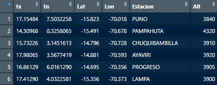
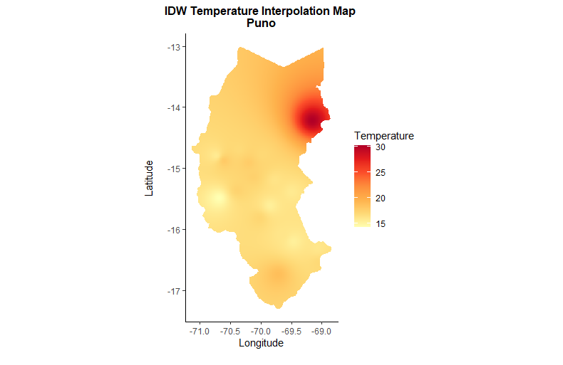
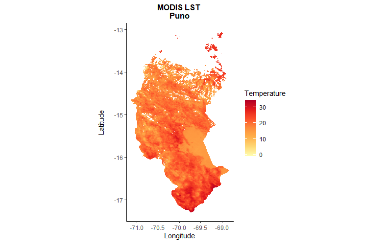

<!-- README.md is generated from README.Rmd. Please edit that file -->

```{r, include = FALSE}
knitr::opts_chunk$set(
  collapse = TRUE,
  comment = "#>",
  fig.path = "man/figures/README-",
  out.width = "100%"
)
```

# coriM

<!-- badges: start -->
<!-- badges: end -->

CoriM is designed with two key functions: `idw_inter` and `mod_lst`. The `idw_inter` function specializes in creating interpolated maps using the IDW (Inverse Distance Weighting) methodology. This process utilizes precise point data, such as maximum and minimum temperatures collected from weather stations, to generate detailed surface representations. On the other hand, `mod_lst` focuses on producing spatial information from the surface temperature data of the MODIS M*D11A2 satellite, whether from Aqua or Terra. A significant advantage of combining these two types of information is the ability to identify regions where the IDW interpolation might have greater or lesser accuracy in its estimates.


## Installation


You can install the development version of **coriM** as follows
```r
 devtools::install_github("xxguisseppe/coriM")
```

If you are prompted for the `rnaturalearth` and `MODIStsp` libraries, they are installed as follows:

*    MODIStsp library:
``` r
 if (!requireNamespace("MODIStsp", quietly = TRUE))  devtools::install_github("ropensci/MODIStsp")
```
*    rnaturalearth library:
``` r
 if (!requireNamespace("rnaturalearth", quietly = TRUE))  devtools::install_github("ropensci/rnaturalearth")
 if (!requireNamespace("rnaturalearthdata", quietly = TRUE)) devtools::install_github("ropensci/rnaturalearthdata")
 if (!requireNamespace("rnaturalearthhires", quietly = TRUE)) devtools::install_github("ropensci/rnaturalearthhires")
```


## Example
The result of the examples produces two files in `TIF format` for the selected region. In this case the example is based on the regional map of Puno in Peru. The information is from the month of March 2010.

**1.    Begin with loading the Library**
```r
## Load Library
 library(coriM)
 ```
**2.    Loading example data in `CSV` format for spatial interpolation.**
```r
## Load example data
file <- loadData()
```


**3.    Run IDW interpolation function**
```r
## Load IDW function with specific inputs
 idw_inter(dat = file, sta = TRUE, cntr="peru",coun_cd = 'PE', alt = TRUE, reg = "Puno", temp="tx")
```



**4.    Generate monthly average LST from MODIS function**
```r
## Load function for MODIS LST monthly calculation
mod_lst (sen = "Aqua", usr = "own_user", pass = "own_password",
           bd = "2010.03.01", ed = "2010.03.31", mnth = "March",
           proj = 4326, cntr = "peru",sta = TRUE, reg = "Puno")
```


**5.    Finally, if you have your own data, you can do this**
```r
## Load own data
file <- ./yourpath/yourfile.csv
```
```r
## If you want to work with regional data
### Load & select region based on the country selected
    selCountry(cntry = "chile")
```


