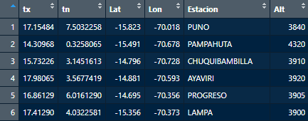
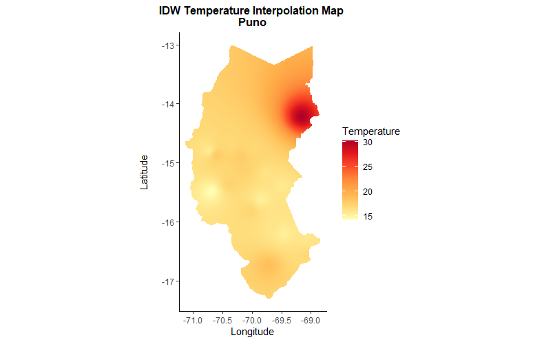
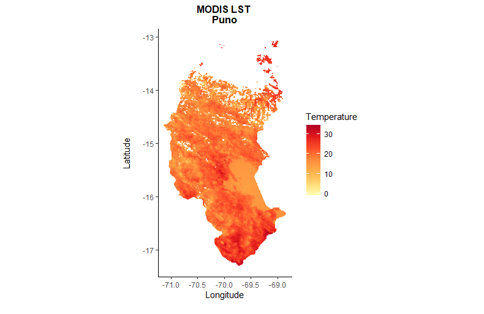

# coriM: Spatial Temperature Interpolation and MODIS LST Processing in R

`coriM` is an R package for geospatial climate analysis. It provides tools to interpolate temperature data from meteorological stations using Inverse Distance Weighting (IDW) and to process MODIS Land Surface Temperature (LST) products.

The package is designed for regional temperature mapping, especially in areas where weather stations are sparse or unevenly distributed. By combining station-based interpolation with satellite-derived LST, `coriM` supports climate, environmental, and agricultural spatial analysis.

---

## Main Features

* Temperature interpolation from meteorological station data using IDW
* MODIS Land Surface Temperature processing from Aqua or Terra products
* Raster output generation in GeoTIFF format
* Regional analysis using administrative boundaries
* Example workflow for Puno, Peru
* Reproducible geospatial workflow in R

---

## Main Functions

| Function       | Description                                                                        |
| -------------- | ---------------------------------------------------------------------------------- |
| `idw_inter()`  | Interpolates station-based temperature data using IDW and generates raster outputs |
| `mod_lst()`    | Processes MODIS Land Surface Temperature products                                  |
| `loadData()`   | Loads example station data included in the package                                 |
| `selCountry()` | Selects country or regional boundaries for spatial analysis                        |

---

## Installation

You can install the development version of `coriM` from GitHub:

```r
# Install devtools if needed
install.packages("devtools")

# Install coriM
devtools::install_github("xxguisseppe/coriM")
```

If required, install the additional spatial and MODIS-related dependencies:

```r
# MODIS processing package
if (!requireNamespace("MODIStsp", quietly = TRUE)) {
  devtools::install_github("ropensci/MODIStsp")
}

# Natural Earth spatial boundaries
if (!requireNamespace("rnaturalearth", quietly = TRUE)) {
  devtools::install_github("ropensci/rnaturalearth")
}

if (!requireNamespace("rnaturalearthdata", quietly = TRUE)) {
  devtools::install_github("ropensci/rnaturalearthdata")
}

if (!requireNamespace("rnaturalearthhires", quietly = TRUE)) {
  devtools::install_github("ropensci/rnaturalearthhires")
}
```

---

## Example Workflow

The example below generates two GeoTIFF outputs for the Puno region in Peru using data from March 2010: one interpolated temperature surface from station data and one MODIS-based Land Surface Temperature product.

### 1. Load the package

```r
library(coriM)
```

### 2. Load example station data

```r
file <- loadData()
```

Example station data:



### 3. Run IDW temperature interpolation

```r
idw_inter(
  dat = file,
  sta = TRUE,
  cntr = "peru",
  coun_cd = "PE",
  alt = TRUE,
  reg = "Puno",
  temp = "tx"
)
```

IDW interpolation output:



### 4. Generate monthly MODIS Land Surface Temperature

```r
mod_lst(
  sen = "Aqua",
  usr = "your_user",
  pass = "your_password",
  bd = "2010.03.01",
  ed = "2010.03.31",
  mnth = "March",
  proj = 4326,
  cntr = "peru",
  sta = TRUE,
  reg = "Puno"
)
```

MODIS LST output:



---

## Using Your Own Data

You can also use your own station data in CSV format:

```r
file <- "path/to/your_file.csv"
```

For regional analysis, select the country or region of interest:

```r
selCountry(cntry = "chile")
```

---

## Repository Structure

```text
coriM/
├── R/                  # Main R functions
├── inst/extdata/       # Example data
├── man/                # Function documentation and README figures
├── tests/testthat/     # Unit tests
├── renv/               # Reproducible R environment
├── DESCRIPTION         # Package metadata
├── NAMESPACE           # Exported functions
├── README.Rmd          # Source README
└── README.md           # GitHub README
```

---

## Skills Demonstrated

* R package development
* Spatial interpolation
* Raster data processing
* MODIS Land Surface Temperature analysis
* Climate and meteorological data processing
* Remote sensing for environmental applications
* Reproducible geospatial workflows

---

## Potential Applications

* Agricultural climate monitoring
* Environmental assessment
* Regional temperature mapping
* Remote sensing validation
* Climate analysis in data-sparse regions
* Comparison between station-based and satellite-based temperature estimates

---

## Author

**Guisseppe A. Vasquez Villano**
M.Sc. Geoinformatics, University of Würzburg

GitHub: [xxguisseppe](https://github.com/xxguisseppe)
LinkedIn: [Guisseppe A. Vasquez Villano](https://www.linkedin.com/in/guisseppev-met/)

---

## License

MIT License
